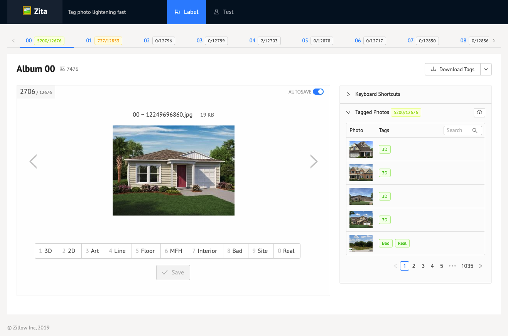
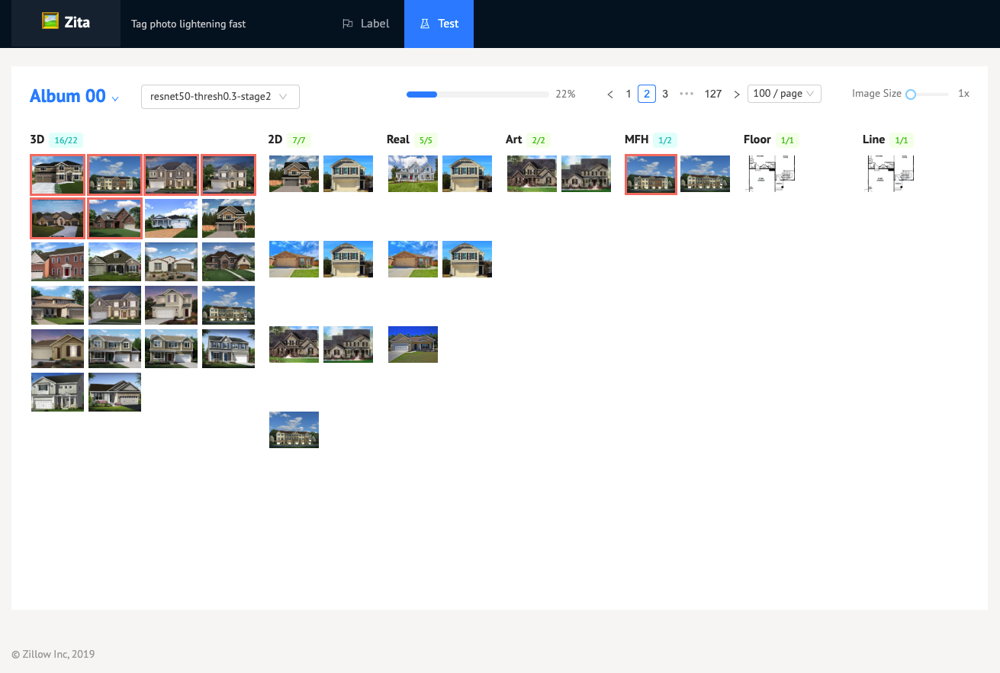

# 🕵️‍♀️ Zita - Zillion Image Tagging App

> Build your own image classification service within a day.

**Zita** is an all-in-one machine learning solution for building production-ready image classification
services. It covers the full life cycle of creating a simple image classifier just like Amazon SageMaker.




## Features

1. An easy-to-use image labelling tool for creating ground truth
2. Out-of-the-box Jupyter notebooks and CLI commands to efficiently train and tune
   modern deep learning image classifiers.
3. High-performance RPC and web API to test, evaluate and serve predictions.

With only minimal setup, anyone can build, train, and deploy a production-ready custom image classification
service within hours.

## Getting Started

We recommend install from source code:

```shell
git clone http://github.com/ktmud/zita.git

# Install Python packages
cd python
pip3 install poetry
poetry install

# Enter the Python envrionment managed by Poetry
poetry shell

# Go back to Zita root
cd ../
npm install
npm run dev
```

This will start the tagging service first. You'd need to tag the photos in the `Label` tab, train models in a notebook, then be able to come back and view training predictions in the "Test" tab.

For details, check out [SETUP.md](./SETUP.md).

## License

MIT
